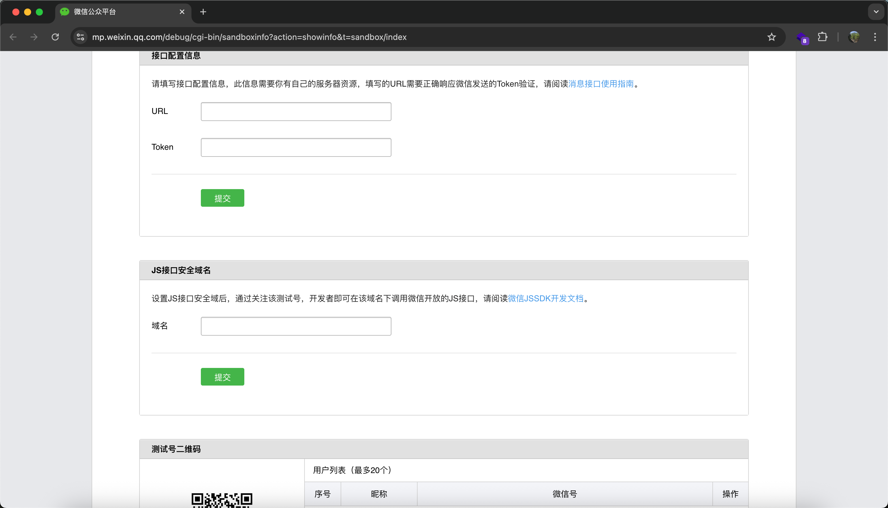
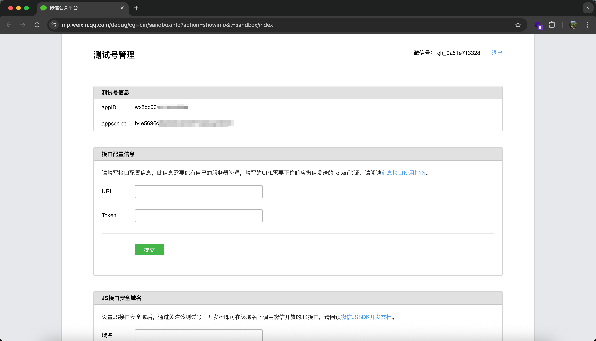
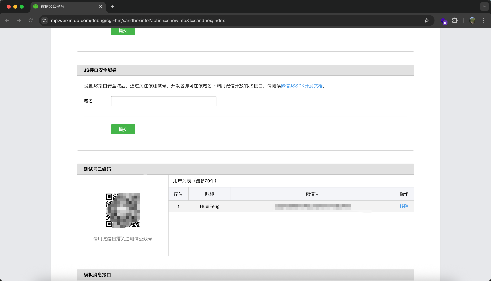
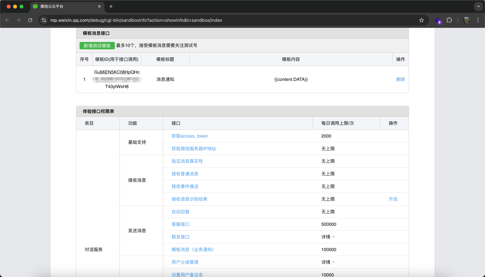
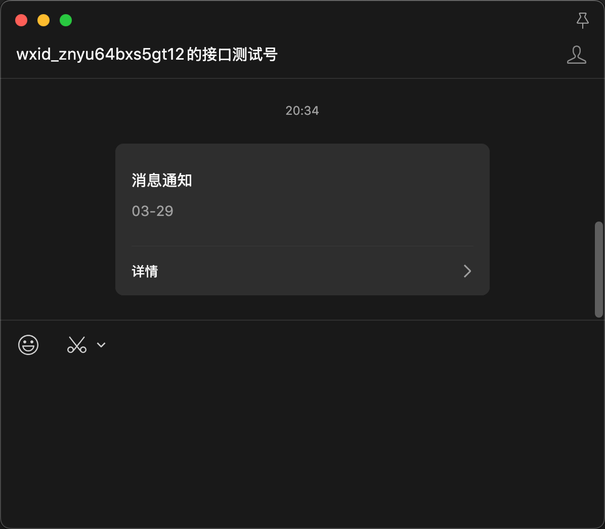
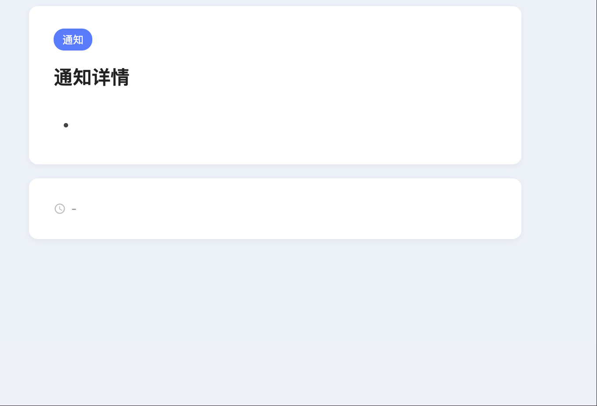

# CSharp-WXPush - 微信消息推送服务

基于 ASP.NET Core 开发的微信测试公众号模板消息推送服务，提供简单的 HTTP API 接口，通过 GET/POST 请求即可将消息推送到指定微信用户。

## 特性

- 完全免费，下载即用
- 支持 Docker 一键部署
- 每天 10 万次推送额度
- 微信原生弹窗 + 声音提醒
- 支持多用户推送
- 自带消息详情页，支持 Markdown 渲染
- 纯 .NET 标准库实现，零第三方依赖
- 单文件核心代码，结构极简

## 准备工作

### 1. 申请微信测试号

前往 [微信公众平台接口测试帐号](https://mp.weixin.qq.com/debug/cgi-bin/sandbox?t=sandbox/login) 扫码登录。



### 2. 获取 AppID 和 AppSecret

登录后在页面顶部可以看到 `appID` 和 `appsecret`。



### 3. 获取用户 OpenID

使用你的微信扫描页面中的测试号二维码关注，关注后在"用户列表"中可以看到你的 `openid`（即 `userid`）。



### 4. 新建消息模板

在"模板消息接口"处点击"新增测试模板"，获取 `template_id`。

> **注意：** 模板内容格式必须为 `标题: {{title.DATA}} 内容: {{content.DATA}}`，不要只写 `{{content.DATA}}`，前面需要加文案，否则推送不显示内容！



## 部署指南

### 直接运行

从 Releases 下载编译好的文件，或自行编译：

```bash
dotnet publish -c Release -o publish
```

启动服务：

```bash
./csharp-wxpush -port 5566 \
  -appid "你的appid" \
  -secret "你的appsecret" \
  -userid "你的openid" \
  -template_id "你的模板ID"
```

启动成功后输出：

```
Server is running on: http://127.0.0.1:5566
```

### Docker 部署

```bash
# 构建镜像
docker build -t csharp-wxpush .

# 启动容器
docker run -d -p 5566:5566 --name wxpush csharp-wxpush \
  -port "5566" \
  -appid "你的appid" \
  -secret "你的appsecret" \
  -userid "你的openid" \
  -template_id "你的模板ID"
```

## 启动参数

| 参数 | 说明 | 默认值 |
|------|------|--------|
| `-port` | 服务监听端口 | `5566` |
| `-appid` | 微信测试号 AppID | - |
| `-secret` | 微信测试号 AppSecret | - |
| `-userid` | 接收消息的用户 OpenID | - |
| `-template_id` | 消息模板 ID | - |
| `-title` | 默认消息标题 | - |
| `-content` | 默认消息内容 | - |
| `-base_url` | 详情页跳转地址 | `http://127.0.0.1:{port}` |
| `-tz` | 时区 | `Asia/Shanghai` |

所有参数既可通过命令行设置默认值，也可在每次请求时通过 URL 参数或 JSON Body 临时覆盖。

## API 使用

### 请求地址

```
http://127.0.0.1:5566/wxsend
```

### GET 请求

```bash
curl "http://127.0.0.1:5566/wxsend?title=服务器通知&content=部署完成"
```

如需临时指定其他用户：

```bash
curl "http://127.0.0.1:5566/wxsend?title=提醒&content=记得喝水&userid=其他用户的openid"
```

### POST 请求

```bash
curl -X POST http://127.0.0.1:5566/wxsend \
  -H "Content-Type: application/json" \
  -d '{
    "title": "Webhook 通知",
    "content": "自动化任务已完成"
  }'
```

### 响应示例

成功：

```json
{"errcode": 0, "errmsg": "ok", "msgid": 4449224443957297156}
```

参数缺失：

```json
{"error": "Missing required parameters"}
```

## 推送效果



## 消息详情页

服务自带消息详情页，微信中点击推送消息即可查看完整内容。

访问地址：`http://127.0.0.1:5566/detail`



如有公网地址，设置 `-base_url` 参数为你的域名即可（无需加 `/detail`）。

## 许可证

MIT License
